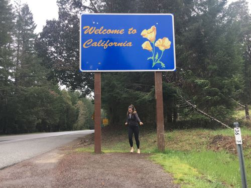
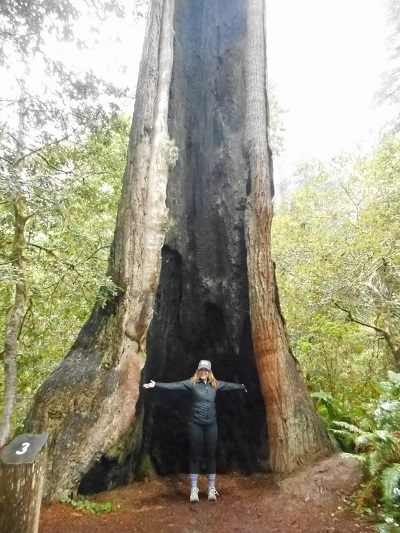
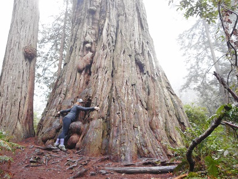
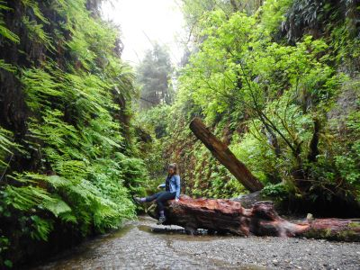
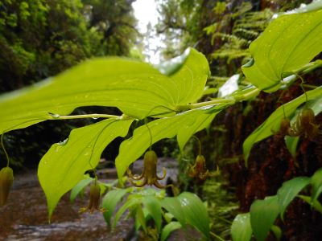
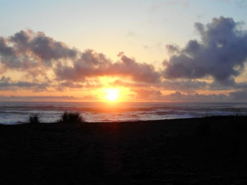

24 hours just wasn't enough. But when I make make up my mind about something, I tend to stick to it. I was determined to spend my birthday in Northern California!

My now fiance and I only had a weekend to spare, and the trip was totally doable. Leaving Portland on Friday night, we drove until we hit Grant's Pass, Oregon to sleep for the night. I'm so glad we did! This allowed us to wake up early the next morning to drive to the Redwoods, which in turn gave us one of the most spectacular drives we had been on. Apparently known as Redwood Highway in Oregon, highway 199 was a bonus for our adventure to California and I highly recommend driving this way if you can. 

If you are unfamiliar, the redwoods are actually broken up into several state parks, with one section that is considered a national park. I will only be talking about those closest to Oregon, so clearly 24 hours isn't long enough to see them all. But I think we did a great job seeing what we did! Our end goal was to make it to the national park, however, the first one we encountered was Jedediah Smith Redwoods State Park as highway 199 drives right through it. 

I guarantee you will never forget the first time you see so many of these enormous trees in one area. 

After passing through Crescent City, California, we continued down the 101 through Del Norte Coast Redwoods State Park. We opted not to stop here as well because I already had an idea of where we were going, but just driving through any of the parks is an adventure in itself.

Eventually we ended up at Redwood National Park. It was a rainy, chilly, foggy, day (as it usually is in this area) but we were ready to get out of the car. I had read about Lady Bird Johnson Grove and we decided to stretch our legs on this short trail. As a 1.4 mile loop, this trail is flat and perfect for viewing some of the tallest trees in the world.

Honestly, I think the weather only added to the appeal of this place! It wasn't raining hard enough to ruin the hike and it only added mystique to an already spectacular place.

Once we completed this hike we decided to actually head back north to Prairie Creek Redwoods State Park. I had two thoughts in mind. While camping among the large trees sounded cool, I knew there was a beach campground right on the ocean that was open year round. It was also conveniently close to another hike that I wanted to do.

Obviously most people think that visiting the Redwoods is just about seeing big trees, but it's so much more than that! Out on the coast there is a canyon covered in ferns, appropriately named, well, Fern Canyon. 

At only about a mile long, this is another easy walk that can be completed in a short amount of time. But I have a hunch you'll be stopping to take lots of pictures. It's not like there are many places in the world where you can stand surround by 50-foot walls that are covered in green ferns! If you're a Jurassic Park fan you'll also enjoy seeing where they filmed one of the scenes from the second movie as well.

By this time it was getting late enough that we were ready to find a campsite and settle in for the night. Gold Bluffs Beach & Campground was just down the road and surprisingly busy for the end of April. There were still a few spots available, though, and we set up camp. The sun came out for a beautiful sunset, creating the perfect ending for a fantastic day.

Of course this is just scratching the surface of what there is to explore along the Northern California coast, but I think we did a pretty good job with the time we had. Can't wait to go back to explore more some day!
